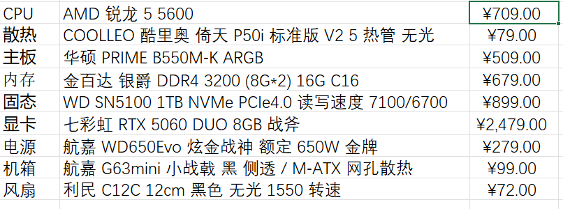
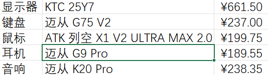
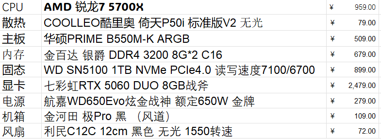
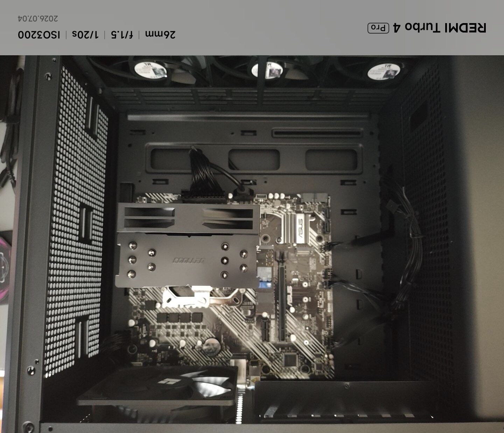
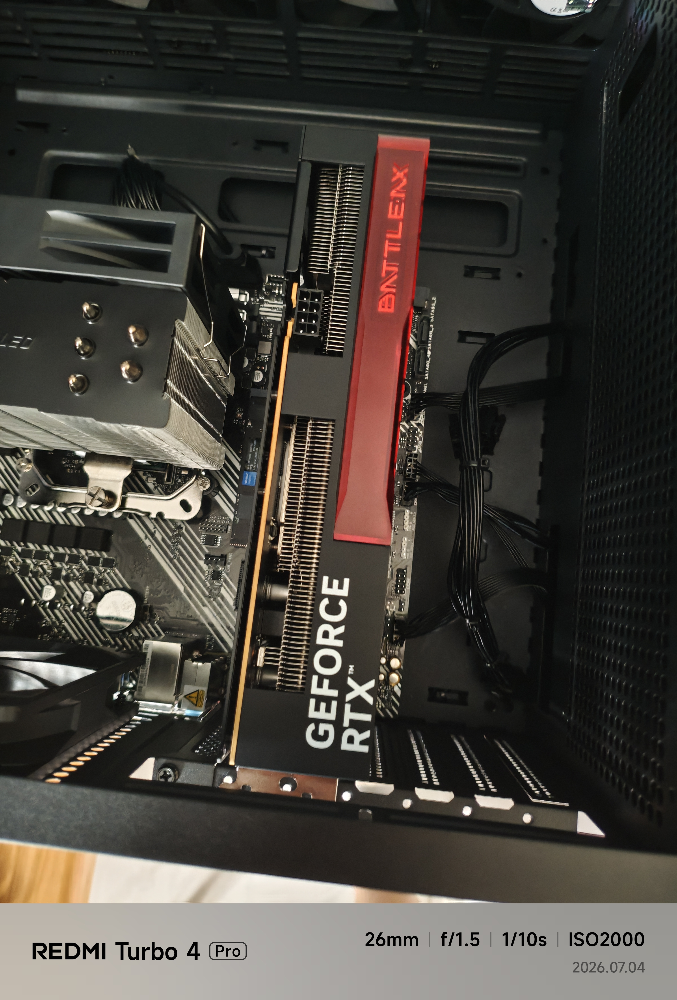
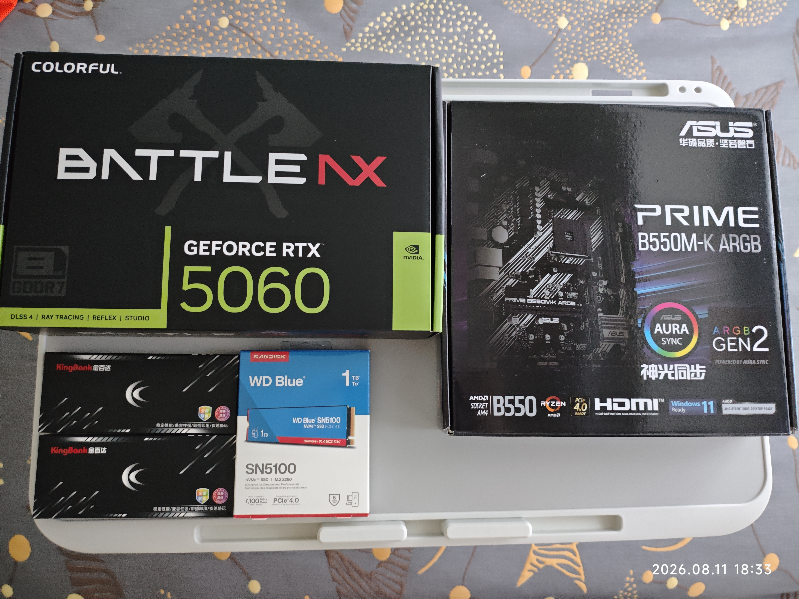
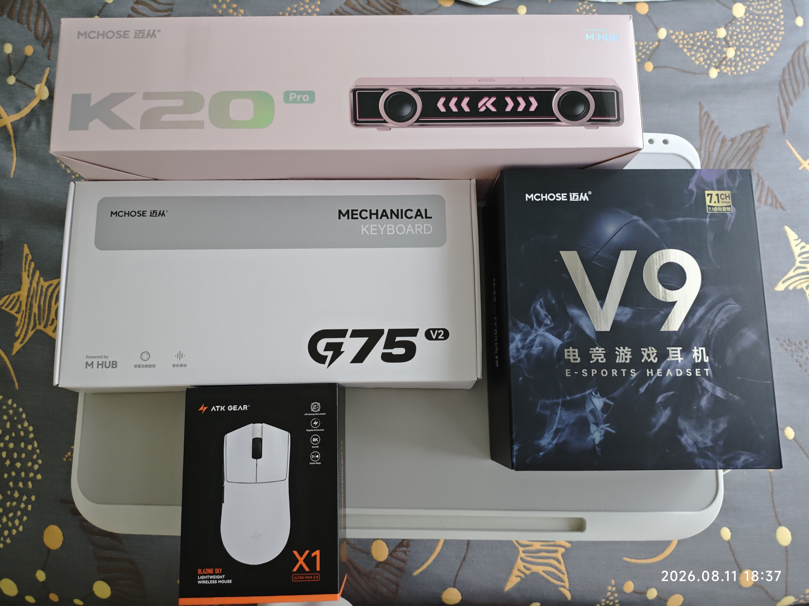

我从 2026 年 4 月开始计划，7 月 4 日装完机。中间三个月一直在备忘录里改配置，最后主机落在六千出头

_值得庆幸的是，我赶在7月中旬显卡，cpu，主板等等配件以及外设的涨价前就装好了_

## 为啥要装

电脑可以完成许多手机上完成不了的事情，**跑环境**，**装各种生产力的app和使用它们**都需要电脑。

预算档位定在八千出头，主机六千、外设一千五左右。这个价位在 2026 年 6 月的大陆行情里可以拿到 6 核甜品 CPU、支持大力水手(DLSS)的显卡加一整套外设，够我用好几年。

## 第一版清单

第一版清单我列在备忘录里：

思路是 CPU 选 5600 打底，把预算尽量分给显卡和固态。5600 六核对我平时用来说够，游戏也不算瓶颈。外设那块我 6 月才敲定，一整套迈从加 KTC 显示器加 ATK 鼠标，1,500 出头拿下一套线上评价不错的组合，此后没再动过。

这版清单我反复对比：**5600 跑本地 LLM 会成为瓶颈**。5060 的 8GB 显存只能塞 7B 到 9B 的模型，再大的模型要卸载到 CPU 跑。到时候多线程数就直接决定推理速度，6 核 12 线程的 5600 会比 8 核 16 线程的 5700X 慢一截。

## 6 月到 7 月的思考

**只升 CPU**：5600 → 5700X，多 2 核 4 线程，价格从 709 涨到 959，差 250 块。TDP 一样是 65W，能延续同一颗单塔散热，不用改其他东西。

## 7 月的最终清单和落地价

7 月 4 日下单当天的清单和到手价如图：

从 6 月到 7 月除了 CPU 换型号，其他配件的价格几乎没变。DDR4 内存、B550 主板、650W 金牌电源这类"成熟品"的价格三个月能稳到几乎不动，我原以为会跌一点，结果一分钱没让。外设 5 件更是一分不差，凑够时机一起下单就行。

## 为什么这么配

- 5700X 加 5060 在 2K 分辨率下打大部分游戏够用。
- 日常打游戏没差，光看游戏帧数这 250 花不值。真正拉开差距的是编译 Rust 项目、跑 llama.cpp 卸载到 CPU 的推理、以及同时开多个开发环境的场景。多的这 2 核 4 线程让 CPU 卸载推理速度快了大约 30%，编译时间短了 20%。当作 3 年的时间摊下来，250 块换这点提升我认可。
- 倚天 P50i 单塔满载时能听到风扇声，日常办公几乎不动转速。四把利民 C12C 全部 PWM 调节，我把最低转速卡在 600 转，主机放在桌下基本听不到。
- KTC 25Y7 是 1080P 300Hz 的电竞屏，带 HDR400，100% sRGB 色域覆盖，661 块拿到这个规格我觉得挺值。1K 分辨率对搭配的 5060 也友好，上 2K 高刷 5060 会喘，1K 300Hz 显卡跑起来轻松。默认色温偏冷，我在 OSD 里改到暖色档就顺眼了。迈从 G75 V2 是 75% 配列的机械键盘，冰蓝轴，段落感清脆偏轻，我也不是高强度的游戏玩家，所以没上磁轴。237 块的价位段我原本担心迈从的做工，一个月用下来键帽和外壳都没翻车。ATK 列空 X1 V2 ULTRA MAX 2.0 这鼠标名字长得离谱，用起来是真轻，200 块内的无线鼠标里做得挺认真。迈从 G9 Pro 是头戴耳机，戴一晚上耳朵不夹，音质对得起 190 块的价位。K20 Pro，放桌上当近场听歌，低频不算深，人声和游戏声效清楚，238 块的价位没再挑剔的余地。5 件一起下来 1,526 块，看着中规中矩。

## 装机当天

装机在 7 月 4 日下午，我一个人装的，没有找师傅。整个流程从拆盒到点亮花了 3 小时。第一次装机全程盯着 B 站教程走。

第一次点亮时主板不亮。我盯着教程截图对了两分钟发现是 pin 电源线没插。这种事第一次装的人容易慌，我当时手心冒汗。

倚天 P50i 装上去意外顺手。它是单塔单风扇，没有前风扇支架去顶内存马甲，塞进 B550M-K 板的时候一次就位。5700X 的默认电压跑双烤 20 分钟温度停在 78°C，我把风扇曲线在 BIOS 里调了一遍，日常温度落在 58°C 附近。79 块的单塔能压住 5700X 这一点让我意外。

## 一些包装盒

## 一些经验

**先想清楚 CPU 会不会成为瓶颈**。我 4 月版差点就订了 5600，多花 250 升 5700X 是对着自己的实际用法算出来的，不是听别人说"多两核好"就冲。

**BIOS 默认设置不等于最佳设置**。内存频率、显卡功耗都值得手动调一遍。半小时的时间能换来长期的温度和噪音收益。

## 最后

装机这件事的乐趣一半在选，一半在装。选的过程可以改十几版清单，装的过程只有一次。
